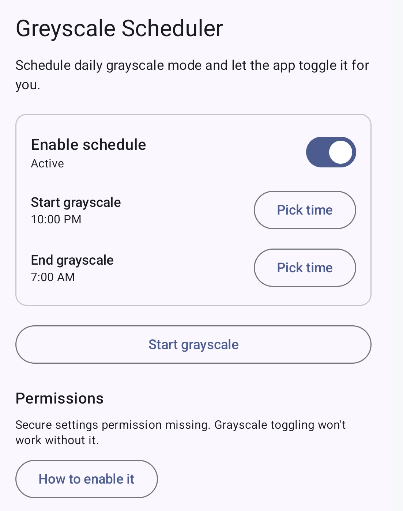

# Greyscale Scheduler

Greyscale Scheduler toggles system-wide grayscale on a daily schedule.



## Why?

For me this is useful because I want to have grayscale automatically activate when entering bedtime mode, but also be able to quickly turn greyscale mode off, and only greyscale mode.
If I turn off bedtime mode completely, tons of messages appear on my notifications, which I don't want to see.
The accessibility color correction settings can not override bedtime mode greyscale mode (yes this is stupid, appearently the color correction and bedtime grayscale mode are two separate things).
The accessibility color correction settings can not be scheduled individually.
Hence this ugly hack.

## Build and Install

Install required tools:
- Gradle Wrapper (gradlew): https://docs.gradle.org/current/userguide/gradle_wrapper.html
- ADB (Android Platform-Tools): https://developer.android.com/studio/releases/platform-tools

From the project root:

```sh
./gradlew :app:assembleDebug
```


The APK will be generated at:
`app/build/outputs/apk/debug/app-debug.apk`

## Install
With a device connected (USB debugging enabled):

```sh
./gradlew :app:installDebug
```

Or install the APK directly:

```sh
adb install -r app/build/outputs/apk/debug/app-debug.apk
```

## Enable WRITE_SECURE_SETTINGS (required for grayscale)
The app needs the privileged permission `WRITE_SECURE_SETTINGS` to toggle system-wide grayscale.
It cannot be granted by the app itself.

1) Enable Developer Options and USB debugging
- Settings -> About phone -> tap Build number 7 times.
- Settings -> Developer options -> enable USB debugging.
- Some OEMs also require "USB debugging (Security settings)" or "Install via USB".

2) Connect the device and authorize ADB
- Connect via USB and accept the USB debugging prompt.
- Verify with `adb devices` (device should be listed as `device`, not `unauthorized`).

3) Grant the permission
```sh
adb shell pm grant de.nielstron.scheduler android.permission.WRITE_SECURE_SETTINGS
```

4) Verify
- Open the app; it should report the permission as granted.
- Tap “Start grayscale” to test.

Revoke if needed:
```sh
adb shell pm revoke de.nielstron.scheduler android.permission.WRITE_SECURE_SETTINGS
```
